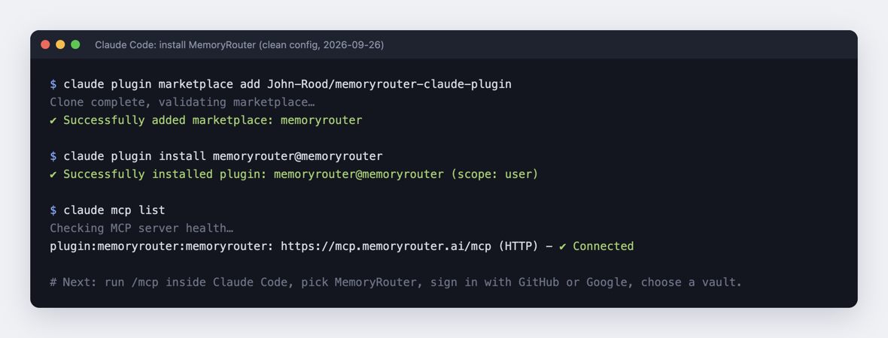

<p align="center">
  
</p>

<h1 align="center">MemoryRouter plugins for Claude</h1>

<p align="center">
  Persistent memory for Claude Code, Claude Cowork, and claude.ai.<br>
  <a href="https://memoryrouter.ai/claude-code?utm_source=github&utm_medium=listing&utm_campaign=directory-blitz">Website</a> ·
  <a href="https://docs.memoryrouter.ai/mcp?utm_source=github&utm_medium=listing&utm_campaign=directory-blitz">Docs</a> ·
  <a href="https://memoryrouter.ai/pricing?utm_source=github&utm_medium=listing&utm_campaign=directory-blitz">Pricing</a> ·
  <a href="CHANGELOG.md">Changelog</a> ·
  <a href="SECURITY.md">Security</a>
</p>

<p align="center">
  <a href="LICENSE"></a>
  <a href="https://github.com/John-Rood/memoryrouter-claude-plugin/releases"></a>
</p>

Claude loses context across sessions and after compaction. MemoryRouter gives Claude Code, Claude Cowork, and claude.ai one persistent, user-scoped memory vault. The same vault also works with ChatGPT, Cursor, Codex, and any other MCP client, so decisions you save in one tool are there in the next.

This repository is a Claude plugin marketplace with two plugins. Both connect to the hosted MemoryRouter MCP server at `https://mcp.memoryrouter.ai/mcp` over OAuth. No API key goes in any file.

| Plugin | OAuth scopes | What it adds |
|---|---|---|
| `memoryrouter` | `memories:read memories:write` | Recall, remember, status, scope, vault, and guarded forget workflows |
| `memoryrouter-readonly` | `memories:read` | Recall, status, scope, and vault workflows with no write path |

Install one of them, not both.

## Install in Claude Code

```
/plugin marketplace add John-Rood/memoryrouter-claude-plugin
/plugin install memoryrouter@memoryrouter
```

For least privilege, install `memoryrouter-readonly@memoryrouter` instead.

Then run `/mcp`, select the MemoryRouter server, and complete OAuth in the browser. Sign in with GitHub or Google and pick the vault Claude should use.



## Install in Claude Cowork or claude.ai

Open **Customize > Plugins > Add** and upload a ZIP of the plugin folder (`plugins/memoryrouter` or `plugins/memoryrouter-readonly`), or install it from an administrator-provided marketplace. Enable it, complete MemoryRouter OAuth, and choose a vault.

## Use it

- `/memoryrouter:memory-scope personal` or `/memoryrouter:memory-scope project <handle>` sets the scope for the conversation.
- `/memoryrouter:recall <topic>` searches the vault and shows where each result came from.
- `/memoryrouter:remember <fact>` saves one concise memory after you ask or approve it.
- `/memoryrouter:memory-status` reports the connection, vault, and scope.
- `/memoryrouter:memory-help` explains usage and limits.

Claude decides when to call memory tools, so recall is not guaranteed on every turn. Ask it to check MemoryRouter when earlier context matters. For automatic per-turn recall and capture in Claude Code, use the hook-based `memoryrouter-claude` package described at [memoryrouter.ai/claude-code](https://memoryrouter.ai/claude-code?utm_source=github&utm_medium=listing&utm_campaign=directory-blitz).

## What the plugins run, send, and fetch

- No hooks, scripts, binaries, or package installs. Each plugin is a `.mcp.json` connector entry plus Markdown skills.
- The only network endpoint is `https://mcp.memoryrouter.ai/mcp`, reached by Claude's own MCP client after you complete OAuth at `https://auth.memoryrouter.ai`.
- Data sent: the search query when Claude recalls, and the memory text when you ask Claude to remember something. Nothing is captured in the background.
- The plugins never request `memories:delete`, so they cannot delete single memories. Item-level curation and deletion live in the dashboard at https://app.memoryrouter.ai.

## Data and permissions

Memories are stored in your MemoryRouter vault and are only reachable with a token you grant through OAuth. You can revoke the grant from Claude (**Customize > Connectors**) or from your MemoryRouter account. Privacy policy: https://memoryrouter.ai/privacy. Terms: https://memoryrouter.ai/terms.

## Pricing

MemoryRouter is free for 14 days, then $20 a month. Cancel anytime. See [memoryrouter.ai/pricing](https://memoryrouter.ai/pricing?utm_source=github&utm_medium=listing&utm_campaign=directory-blitz).

## Support

- Support page: https://memoryrouter.ai/support
- Email: hello@memoryrouter.ai
- Security reports: see [SECURITY.md](SECURITY.md)
- Issues: https://github.com/John-Rood/memoryrouter-claude-plugin/issues

## License

[MIT](LICENSE)
